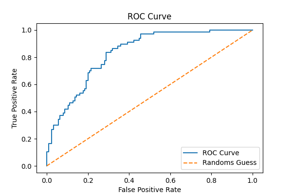

# Diabetes Risk Prediction Using Logistic Regression

This project builds a machine learning model to predict the likelihood of diabetes using patient diagnostic data. A logistic regression model was developed and evaluated using accuracy, confusion matrix, and ROC-AUC to assess performance.

The project follows a complete end-to-end workflow, including data cleaning, exploratory analysis, feature scaling, model training, and evaluation. It also explores how adjusting classification thresholds and removing features can impact model performance.

## Tools & Technologies

- Python
- pandas
- NumPy
- scikit-learn
- Matplotlib

## Dataset

The dataset used in this project was sourced from Kaggle and is based on data collected by the National Institute of Diabetes and Digestive and Kidney Diseases.

It includes 768 patient records with medical diagnostic measurements used to predict whether a patient has diabetes. All individuals in the dataset are female, at least 21 years old, and of Pima Indian heritage.

The dataset contains several predictor variables such as glucose level, BMI, insulin, and age, along with a binary target variable **Outcome**:

- 0 indicates no diabetes  
- 1 indicates diabetes  

Dataset link: [Kaggle - Diabetes Dataset](https://www.kaggle.com/datasets/mathchi/diabetes-data-set)

## Model Results

- Accuracy: ~73%  
- Sensitivity (Diabetes Detection): ~52%  
- Specificity (Non-Diabetes Detection): ~85%  
- AUC Score: ~0.83  

The model performs well overall, particularly in identifying non-diabetic patients. 
However, it is less effective at detecting diabetes cases, indicating room for improvement 
in identifying positive cases.

## ROC Curve

The ROC curve shows strong model performance, with an AUC of approximately 0.83, indicating good separation between diabetic and non-diabetic patients.